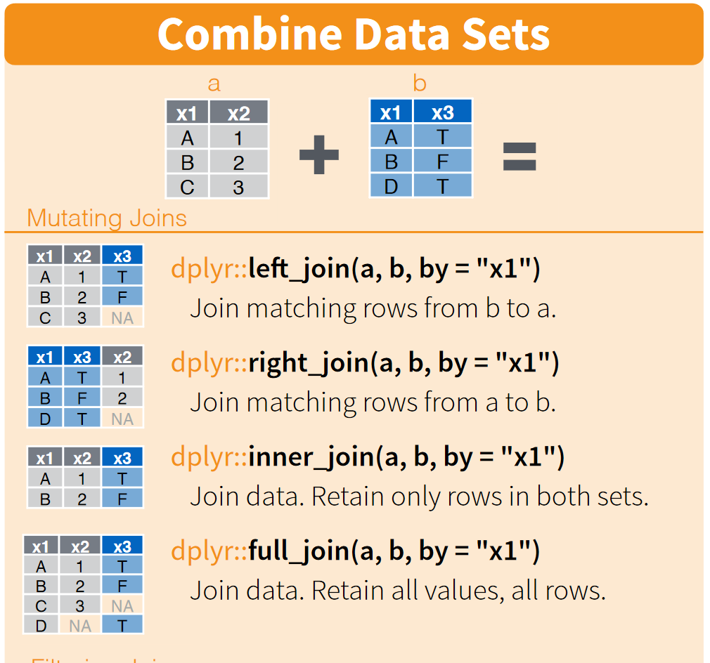

layout:true
<div class="my-footer"><span>Introduksjon</span></div>
---

```{r setup, include=FALSE}
options(htmltools.dir.version = FALSE)
```

```{r xaringan-themer, include=FALSE, warning=FALSE}
library(xaringanthemer)
style_mono_accent(
  base_color = "#1c5253",
  header_font_google = google_font("Open Sans"),
  text_font_google   = google_font("Open Sans"),
  code_font_google   = google_font("Fira Mono")
)
```

## Hvorfor R?
.pull-left[
Sentrale arbeidsoppgaver i OE: 

  - Databehandling
  - Analyse
  - Visualisering

Alle tre bør dokumenteres. Det gjør det mulig å replikere analysen (av deg selv eller andre), og gir transparens.
 
]

.pull-right[
Det er her R/Python/Stata kommer inn ==> dokumentasjonen ligger i koden!

Både R, Python og Stata er gode til databehandling og analyse.

R er allsidig, open source, har stor brukermasse innenfor samfunns-vitenskap og svært bra GIS-funksjonalitet. 

<!-- Velg Excel for å lage diagrammer, og dersom du trenger kjappe og enkle analyser. Velg QGIS for å lage pene kart, men vær oppmerksom på at det kan være tidkrevende dersom du trenger å gjøre det på nytt (f.eks. på andre data). -->
]

| Verktøy | Databehandling | Analyse        | Diagrammer    | Kart      |
|---------|----------------|----------------|---------------|-----------|
| Excel   | omg just don't | omg just don't | Ja            | Begrenset |
| Stata   | Ja             | Ja             | Ja            | Begrenset |
| Python  | Ja             | Ja             | Ja            | Ja        |
| R       | Ja             | Ja             | Ja            | Ja        |
| QGIS    | Begrenset      | Nei            | Nei           | Ja        |  

---

## Hva vil du lære på dette kurset?

- **R basics**: Kodeprinsipper og vanligste funksjoner
- **Tidyverse**: Behandling og sjonglering av data
- **Arbeidsflyt**: Veien fra rådata til analyseresultater
- Enkle regresjonsanalyser m/eksport av resulater til en tabell
- Hvordan skrive pene og forståelige R-script
- Scriptet nedlasting av data vha. API
- Lage kart og diagrammer

Vi bruker det innebygde datasettet `mtcars` for å illustrere funksjonalitet


---
layout:true
<div class="my-footer"><span></span></div>
---

class: center, middle

# R basics

---
layout:true
<div class="my-footer"><span>R basics</span></div>
---

## Objekter
R er et *objektorientert* språk. De vanligste objekttypene er `vector`, `matrix`, `data.frame` og `list`. Vi lager objekter (og fyller dem med informasjon) ved hjelp av en "venstre-pil".


```{r eval=TRUE}
n1 <- 420
```

Objekter forblir lagret i minnet fram til R avsluttes, eller til man fjerner objektet manuelt ved hjelp av `rm()`. 

Datasett lagres som `data.frame`-objekter. R tillater mange datasett i minnet samtidig, til forskjell fra f.eks. Stata.

---

## Operatorer

`=` brukes inni funksjoner, ikke til å lage objekter:
  
  
```{r eval=TRUE}
n2 <- paste("4", "2", "0", sep = "") # "limer" sammen 4, 2 og 0
```

Dobbelt likhetstegn brukes for å sammenligne noe (som i Stata)


```{r eval=TRUE}
n1 == as.integer(n2) 
```

Ellers fungerer de vanlige matematiske operatorene som forventet

```{r eval=TRUE}
(200 + 15 - 5) * 2
```

---

## Objekttyper

Vi har altså `vector`, `matrix`, `data.frame` og `list`. `matrix` består av én eller flere `vector`. 


```{r eval=TRUE}
v1 <- c(3, 4) # c()-funksjonen lager vektorer
matrix(c(v1, v1), nrow = 2, ncol = 2)
```

Datasett som leses inn i R lagres vanligvis som `data.frame`, som er en variant av `list`.

```{r eval=TRUE}
class(mtcars) 
```

```{r eval=TRUE}
typeof(mtcars) # typeof gir den underliggende datastrukturen
```

---

## Hente ut elementer fra objekter

  Det finnes hovedsakelig to funksjoner for å hente ut elementer av objekter, `$` og `[]`. Førstnevnte fungerer bare på `data.frame` og `named list`. Syntaksen er `mtcars$kolonnenavn` og `mtcars[, kolonne]`. I sistnevnte kan også rader spesifiseres.


```{r eval=FALSE}
# Alle rader, kolonnen "cyl"
mtcars$cyl 
mtcars[, "cyl"] # merk anførselstegn her
```

```{r eval=FALSE}
# Rad 1 til 3, kolonne "cyl"
mtcars$cyl[1:3]
mtcars[1:3, "cyl"]
mtcars[1:3, 2] # Kan også bruke kolonnens plassering.
```

Klamme-syntaksen kan også brukes til å lage "delmengder":
  
```{r eval=FALSE}
mtcars[mtcars$cyl > 4, ] # Alle rader der "cyl" er større enn 4
mtcars[mtcars$cyl > 4, "cyl"] # Alle verdier av "cyl" større enn 4
```

---

## list-objekter

Et `list`-objekt er en liste med objekter, for eksempel en liste med `data.frame`. `list`-objekter er hierarkiske og kan ha mange nivåer.


```{r eval=FALSE}
l1 <- list(3, 4) # `list` med ett nivå
l2 <- list(list(3, 4), list(5, 6)) # `list` med to nivåer
```

Syntaksen for å hente ut elementer fra en liste er litt spesiell. Dersom listen er navngitt, kan `$` benyttes. Hvis ikke, brukes doble klammer:
  
  
```{r eval=TRUE}
testlist <- list("element1" = 3, "element2" = 4) # navngitt liste 
testlist[[1]]
```

```{r eval=TRUE}
testlist$element1
```

---

## list-objekter: Eksempel
Lister er nyttige dersom du trenger å utføre samme operasjon på flere objekter. For eksempel samme regresjon på flere datasett:
  
  
```{r eval = TRUE}
mtl <- list("Original" = mtcars, "Modified" = mtcars[mtcars$cyl > 4, ])
lapply(mtl, function(x) {
  reg <- lm(mpg ~ hp + wt, data = x)
  summary(reg)$coefficients
})
```

---

## Pakker

De viktigste funksjonene er integrert i R. Øvrige funksjoner finnes i *pakker* som hentes inn med  `library`-funksjonen (tilsvarer `include` i Python).

```{r, eval = FALSE}
install.packages("dplyr") # Må installeres først.
library(dplyr)            
filter(mtcars, cyl >= 8)  # Kun biler med svær motor
```

- **NB:** Ulike pakker kan inneholde funksjoner som deler navn med hverandre. Feks. `filter`-funksjonen i `dplyr` deler navn med en pakke i den innebygde `stats`-pakken.
- Den siste pakken som lastes inn får prioritet ved navnekonflikt.
 
---

## Direkte henvisning til funksjoner

Det er mulig å benytte spesifikke funksjoner uten å hente den inn vha. `library` først. Nyttig dersom flere pakker benytter samme funksjonsnavn:

```{r, eval = TRUE}
filtered <- dplyr::filter(mtcars, cyl >= 8)
head(filtered, 2) # Kun de to første radene
```

```{r, eval = FALSE}
stats::filter(mtcars, cyl >= 8) # Funker ikke på samme måte
```

```{r, eval = TRUE, echo=FALSE, message = TRUE, error = TRUE}
tryCatch(stats::filter(mtcars, cyl >= 8), error = function(cond) message(cond))
```

---
layout:true
<div class="my-footer"><span></span></div>
---

class: center, middle

# Tidyverse


---
layout:true
<div class="my-footer"><span>Tidyverse</span></div>
---

## Tidyverse
`dplyr`-pakken vi nettopp har brukt er en del av `tidyverse`, en samling med pakker som er skapt for databehandling, og deler samme grammatikk, datastruktur og underliggende filosofi. 

Syntaksen i dette "universet" skiller seg fra standard R-syntaks, men er bygget på en mer intuitiv tilnærming til databearbeiding.

`dplyr`-syntaksen er basert på **verb**, og beskriver nærmest med ord hva som skjer med dataene (på ængelsk da): 

```{r eval = FALSE} 
filter(mtcars, cyl >= 8)
```
kan oversettes til "filter `mtcars`, keeping only cars with at least 8 cylinders".

Vi kommer stort sett til å forbli innenfor `tidyverse` i resten av dette kurset. 

---

## Pipe-operatoren

Pipe-operatoren står sentralt i `tidyverse` (og særlig `dplyr`). I base-R gjør man flere operasjoner ved å mellomlagre resultater i objekter underveis, eller putte funksjoner inni funksjoner:

```{r eval = FALSE}
# Enten
large <- mtcars[mtcars$cyl >= 8, ]  # Lagre nytt datasett med biler med store motorer
mean(large$wt)                      # Ta gjennomsnitt av vekten av bilene
# Eller
mean(mtcars[mtcars$cyl >= 8, "wt"]) # Begge operasjoner i én linje
```

I `tidyverse` bruker man piping for å gjøre flere ting samtidig:

```{r eval = FALSE, messages = FALSE}
library(dplyr)
mtcars %>%             # Deklarer objektet som operasjoner skal utføres på
  filter(cyl >= 8) %>% # Filtrer ut biler med store motorer
  pull(wt) %>%         # Trekk ut variabelen `wt` som en vektor
  mean()               # Ta gjennomsnittet av vektoren `wt`
```

Syntaksen i base-R er ofte mer kompakt, men `tidy`-syntaksen er lettere å lese, og er mer i tråd med den faktiske rekkefølgen i operasjonene.

???

I siste versjon av R er det en innebygget pipe-operator.

---

## String-matching

Vi er ofte nødt til å gjøre tekstsøk for å kategorisere eller filtrere data. Dette er lettvint i `tidy`-syntaks, vha. `stringr`-pakken:

```{r eval = TRUE, message=FALSE}
library(tidyverse)
tysk <- c("Merc|Porsche")            # Merc(edes) eller Porsche

mtcars %>%
  mutate(name = rownames(.)) %>%     # Lag variabel for bilmodell basert på radnavn
  filter(str_detect(name, tysk)) # Hent ut alle rader med tyske bilmerker
```

---

## Merging/joining av data

```{r eval = TRUE, message = FALSE}
library(tidyverse)
motor <- data.frame(cyl = c(4, 6, 8), størrelse = c("liten", "medium", "stor"))
mtcars %>%
  left_join(motor, by = "cyl") %>% # "merge" med datasettet med motorstørrelse
  summarytools::freq(størrelse)
```

---

layout: true

---

## Ulike typer joins

.pull-left[
  
]

.pull-right[
- `by = "x1"` betyr matching på `x1`-variabelen. Kan matche på flere variabler, og de trenger ikke ha samme navn i `a` og `b`
  - `by = c("x1", "id_a" = "id_b"))`
- `left_join()` og beholder alle rader i `a`
  - Jeg bruker denne i 80 % av tilfellene
  - tilsvarer `merge` i Stata
  - `m:1` er implisitt dersom samme rad i `a` matcher flere rader i `b`
- `right_join()` beholder alle rader i `b`
- `inner_join()` beholder kun rader i `a` som matcher rader i `b`
- `full_join()` beholder alle rader i både `a` og `b`

]

---

## Reshaping: "long" til "wide"

Reshaping i `tidyverse` kalles "pivotering".
`pivot_wider` tilsvarer `reshape wide` i Stata:

```{r eval = TRUE}
library(tidyverse)
data("Fatalities", package = "AER") # Last inn datasettet.
fatal_compact <- Fatalities %>%
  select(state, year, fatal) 
head(fatal_compact, 3)
fatal_wide <- fatal_compact %>% # I Stata: reshape wide fatal, i(state) j(year)
  pivot_wider(names_from = year, values_from = fatal, names_prefix = "fatal")
head(fatal_wide, 1)
```

???

Merk: Variabler som ikke spesifiseres som "navnevariabel" eller "verdivariabel" tolkes automatisk som "id-variabel"

---

layout: true
<div class="my-footer"><span>Tidyverse</span></div>

---
## Reshaping: "wide" til "long"

`pivot_longer` tilsvarer `reshape long` i Stata:

```{r eval = FALSE}
fatal_long <- fatal_wide %>% # I Stata: reshape long fatal, i(state) j(year)
  pivot_longer(cols = starts_with("fatal"),
               names_to = c("year"), names_prefix = "fatal", values_to = "fatal")

head(fatal_long, 5)
```

???

Akkurat reshaping av data er nok lettere i Stata. Jeg ender ofte opp med å google `pivot`-funksjonene...

---


